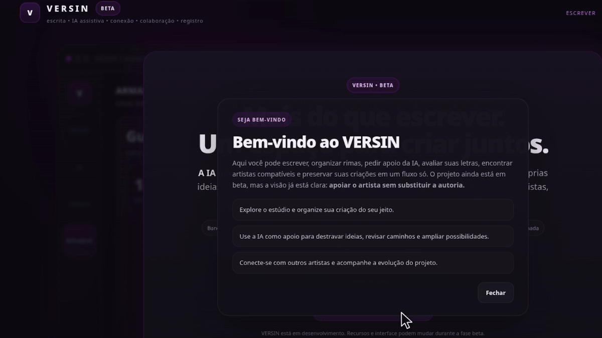

<p align="center">
  
</p>

<p align="center">
  <strong>Componha. Encontre artistas. Crie em conjunto.</strong>
</p>

<p align="center">
  O VERSIN é uma plataforma de criação e colaboração musical que reúne composição,
  IA assistiva, descoberta de artistas, comunicação, projetos colaborativos
  e preservação das criações em um único ambiente.
</p>

<p align="center">
  <strong>VERSIN • BETA</strong>
</p>

---

# VERSIN

## Plataforma de criação e colaboração musical

O **VERSIN** nasce com uma proposta simples: permitir que artistas criem, se conectem e desenvolvam projetos musicais sem precisar dividir todo o processo entre várias ferramentas diferentes.

A plataforma reúne recursos de composição, organização criativa, IA assistiva, descoberta de artistas, perfis públicos, comunicação, colaboração em projetos e preservação de versões de uma criação.

A inteligência artificial faz parte desse processo como uma ferramenta de apoio.

Ela pode ajudar a encontrar possibilidades, explorar rimas, analisar uma letra e oferecer feedback, mas não é tratada como substituta do processo artístico.

> **A IA auxilia. O artista cria.**

---

# 1. Visão do projeto

O VERSIN está sendo construído como um ambiente em que diferentes etapas de uma criação musical possam acontecer dentro do mesmo ecossistema.

Um artista pode iniciar uma composição no Estúdio, organizar ideias, trabalhar em uma letra, consultar rimas, receber apoio da IA, encontrar outro artista disponível para colaborar, iniciar uma conversa, formar um projeto e continuar a produção em conjunto.

A proposta não é definir como alguém deve criar.

O VERSIN deve oferecer ferramentas que acompanhem diferentes processos criativos e permitam que cada artista construa o próprio fluxo de trabalho.

---

# 2. Princípios do VERSIN

O desenvolvimento do projeto segue alguns princípios centrais:

- o artista permanece no centro do processo criativo;
- a IA funciona como apoio, não como substituição da autoria;
- colaboração deve acontecer de forma simples e integrada;
- comunicação e produção devem fazer parte do mesmo fluxo;
- cada usuário deve manter controle sobre suas criações e arquivos;
- a integridade de versões salvas deve poder ser verificada;
- recursos sociais devem respeitar disponibilidade, consentimento e privacidade;
- a plataforma deve continuar evoluindo de forma aberta e modular.

---

# 3. Estúdio de criação

O **Estúdio** é o espaço principal de composição do VERSIN.

Ele foi pensado para concentrar ferramentas que normalmente ficam espalhadas entre editores de texto, aplicativos de notas, listas de rimas e outros programas auxiliares.

Entre as possibilidades do Estúdio estão:

- escrita de letras;
- estruturação de músicas;
- organização de versos, refrões, pontes e outras partes;
- banco de rimas;
- organização de ideias;
- mapa de ideias;
- timeline da composição;
- acompanhamento da evolução de uma música;
- integração com recursos de IA assistiva.

O objetivo é permitir que o artista permaneça dentro do processo criativo sem precisar trocar constantemente de ferramenta.

---

# 4. IA assistiva

A IA do VERSIN é projetada como uma camada de apoio à criação.

O artista pode utilizá-la para:

- buscar rimas;
- explorar palavras relacionadas;
- encontrar novas possibilidades;
- analisar uma letra;
- receber feedback;
- observar coerência;
- avaliar estrutura;
- analisar originalidade;
- analisar construção de rimas;
- explorar diferentes caminhos para uma ideia.

A resposta da IA não representa uma decisão final sobre a criação.

O usuário continua escolhendo o que faz sentido para sua música, sua identidade e seu processo.

> **A IA oferece possibilidades. O artista decide o caminho.**

---

# 5. Match e conexão entre artistas

O VERSIN também busca resolver outro problema comum do processo musical: encontrar pessoas compatíveis para criar junto.

O módulo de **Match** permite descobrir artistas e profissionais com potencial de colaboração.

A descoberta pode considerar diferentes informações do perfil e do contexto de cada usuário, como:

- função musical;
- interesses de colaboração;
- disponibilidade;
- informações públicas do perfil;
- modo de descoberta;
- proximidade quando o usuário autorizar recursos relacionados à localização.

A proposta é permitir tanto descoberta quanto conexão rápida.

Quando duas pessoas encontram interesse em trabalhar juntas, o VERSIN pode transformar essa conexão em uma colaboração real dentro da plataforma.

---

# 6. Perfil artístico

Cada usuário pode construir uma identidade própria dentro do VERSIN.

O perfil artístico pode reunir informações como:

- nome artístico;
- foto ou avatar;
- biografia;
- funções musicais;
- trabalhos;
- faixas;
- informações relevantes para colaboração;
- disponibilidade.

O perfil funciona como a presença pública do artista dentro do ecossistema.

Ele também ajuda outros usuários a entenderem quem aquela pessoa é, o que ela faz e em quais tipos de projeto pode colaborar.

---

# 7. Colaboração

Depois de uma conexão, o VERSIN pode levar os artistas para um ambiente de colaboração.

A proposta é transformar um match em algo maior do que uma simples conversa.

Os participantes podem trabalhar em conjunto dentro de um projeto e acompanhar:

- membros;
- responsabilidades;
- tarefas;
- atividades;
- contribuições;
- entregas;
- evolução do projeto;
- histórico das ações.

Isso permite que a colaboração continue organizada mesmo quando o projeto passa a envolver várias pessoas.

---

# 8. Projetos compartilhados

Um projeto dentro do VERSIN pode reunir diferentes recursos relacionados à produção.

Entre eles:

- membros;
- convites;
- tarefas;
- contribuições;
- arquivos;
- atividades recentes;
- comunicação;
- histórico;
- entregas;
- registros relacionados ao processo criativo.

A intenção é que cada colaboração tenha um espaço próprio, em vez de depender de mensagens espalhadas entre aplicativos diferentes.

---

# 9. Comunicação

O VERSIN integra comunicação diretamente ao fluxo de colaboração.

O projeto inclui recursos voltados para:

- conversa entre participantes;
- mensagens;
- áudio;
- chat de projeto;
- chamadas;
- chamadas de voz;
- chamadas com vídeo;
- convites de comunicação;
- permissões relacionadas à comunicação.

A comunicação deve respeitar consentimento e contexto.

Uma conexão entre artistas não significa que toda forma de contato precisa estar automaticamente disponível.

O VERSIN está sendo estruturado para permitir controle sobre como cada pessoa deseja interagir.

---

# 10. Preservação da criação

O VERSIN também possui uma camada voltada à preservação de trabalhos.

O usuário pode registrar e armazenar conteúdos como:

- letras;
- batidas;
- arquivos relacionados a uma obra;
- versões de trabalhos.

Para determinadas versões, o sistema pode gerar uma **impressão digital criptográfica**, como um hash.

Essa impressão permite verificar que um determinado conteúdo corresponde àquela versão registrada.

Isso pode ajudar em:

- integridade;
- rastreabilidade;
- comparação de versões;
- organização do histórico da criação.

> **Importante:** uma impressão digital ou hash verifica a integridade de um conteúdo. Por si só, ela não constitui prova automática de autoria legal.

---

# 11. Royalties e divisão

O VERSIN também está evoluindo para organizar aspectos relacionados à participação de diferentes pessoas em um projeto.

Essa área pode incluir recursos como:

- participantes;
- percentuais;
- acordos;
- aprovações;
- distribuição;
- histórico de alterações;
- eventos relacionados à divisão de participação.

O objetivo é tornar mais claro quem participou do projeto e como determinados acordos foram organizados.

Essa área ainda faz parte da evolução do produto e não deve ser interpretada como substituta de contratos, serviços jurídicos ou sistemas profissionais de arrecadação.

---

# 12. Atividades e notificações

Conforme o ecossistema cresce, o VERSIN precisa ajudar o usuário a entender o que aconteceu dentro dos seus projetos.

Por isso, o projeto também possui componentes relacionados a:

- atividades recentes;
- notificações;
- convites;
- atualizações de projetos;
- mudanças em tarefas;
- novas conexões;
- eventos importantes.

A intenção é evitar que colaboração, comunicação e produção se tornem difíceis de acompanhar.

---

# 13. Arquitetura

O VERSIN é desenvolvido com uma arquitetura multiplataforma e modular.

## Aplicação

A aplicação principal é desenvolvida em **Flutter**.

Isso permite compartilhar grande parte da base de código entre diferentes plataformas e manter uma experiência consistente.

Plataformas consideradas pelo projeto:

- Linux;
- Windows;
- macOS;
- Android;
- iOS;
- Web.

## Supabase

O Supabase é utilizado em áreas como:

- autenticação;
- banco de dados;
- realtime;
- armazenamento;
- regras de acesso;
- sincronização entre usuários e projetos.

## API em Python

O VERSIN possui uma API própria em Python para funções de servidor e recursos relacionados à IA.

Essa camada pode atuar em tarefas como:

- processamento de solicitações de IA;
- aplicação de regras;
- controle de quotas;
- segurança de requisições;
- integração com serviços externos;
- operações que não devem depender diretamente do cliente Flutter.

## Infraestrutura complementar

Outros componentes podem ser utilizados para necessidades específicas de infraestrutura, armazenamento e publicação.

A arquitetura continua evoluindo conforme novos módulos são integrados ao produto.

---

# 14. Segurança e privacidade

O VERSIN trabalha com informações que podem representar criações ainda não publicadas.

Por isso, segurança e privacidade fazem parte da arquitetura do projeto.

Entre as direções adotadas estão:

- autenticação de usuários;
- autorização por recurso;
- políticas de acesso no banco;
- isolamento de dados;
- proteção de arquivos;
- controle de comunicação;
- consentimento para recursos sensíveis;
- proteção de credenciais e segredos;
- validação de operações no servidor.

Recursos relacionados à localização, arquivos privados, comunicação ou projetos compartilhados devem respeitar autorização explícita do usuário.

---

# 15. Estrutura geral do produto

De forma simplificada, o VERSIN pode ser entendido assim:

```text
VERSIN
│
├── Estúdio
│   ├── Letras
│   ├── Estrutura musical
│   ├── Banco de rimas
│   ├── Mapa de ideias
│   └── Timeline
│
├── IA assistiva
│   ├── Rimas
│   ├── Exploração de ideias
│   ├── Análise
│   └── Feedback
│
├── Match
│   ├── Descoberta
│   ├── Busca
│   ├── Disponibilidade
│   └── Conexão
│
├── Perfil artístico
│   ├── Bio
│   ├── Funções
│   └── Trabalhos
│
├── Projetos
│   ├── Membros
│   ├── Convites
│   ├── Tarefas
│   ├── Contribuições
│   └── Histórico
│
├── Comunicação
│   ├── Chat
│   ├── Áudio
│   └── Chamadas
│
├── Preservação
│   ├── Letras
│   ├── Batidas
│   ├── Arquivos
│   └── Hashes de integridade
│
└── Royalties
    ├── Participantes
    ├── Divisões
    ├── Aprovações
    └── Histórico
```

---

# 16. Fluxo de uma colaboração

Um fluxo possível dentro do VERSIN pode ser representado assim:

```text
Criar perfil
     ↓
Explorar artistas
     ↓
Encontrar uma conexão
     ↓
Confirmar interesse
     ↓
Criar ou entrar em um projeto
     ↓
Conversar / realizar chamada
     ↓
Dividir tarefas
     ↓
Enviar contribuições
     ↓
Acompanhar a evolução
     ↓
Preservar versões da criação
```

O objetivo é reduzir a distância entre **encontrar alguém para colaborar** e **realmente construir alguma coisa com essa pessoa**.

---

# 17. Estado do projeto

O VERSIN está atualmente em **BETA**.

Isso significa que:

- funcionalidades podem mudar;
- partes da interface ainda estão sendo refinadas;
- módulos podem ser reorganizados;
- fluxos podem evoluir;
- algumas funcionalidades ainda estão em desenvolvimento;
- a arquitetura continua sendo amadurecida.

O repositório representa um projeto em construção ativa.

---

# 18. Open source

O VERSIN é um projeto **open source**.

Uma das intenções do projeto é permitir que desenvolvedores interessados em música, tecnologia, colaboração e ferramentas criativas possam participar da construção.

Estamos especialmente interessados em contribuições relacionadas a:

- Flutter;
- Dart;
- Python;
- Supabase;
- backend;
- realtime;
- WebRTC;
- segurança;
- testes;
- arquitetura;
- UX/UI;
- performance;
- documentação;
- infraestrutura.

Não é necessário conhecer todas essas áreas para contribuir.

Se você encontrou uma parte do projeto que pode melhorar, uma contribuição pequena também pode ser valiosa.

---

# 19. Como colaborar

Se você deseja contribuir com o VERSIN:

1. faça um fork do repositório;
2. crie uma branch para sua alteração;
3. desenvolva e teste sua contribuição;
4. mantenha a alteração focada e bem documentada;
5. abra um Pull Request explicando o que foi modificado e por quê.

Exemplo:

```bash
git checkout -b feature/minha-contribuicao
```

Depois:

```bash
git add .
git commit -m "feat: descreve a contribuição"
git push origin feature/minha-contribuicao
```

Por fim, abra um Pull Request para revisão.

---

# 20. Direção do VERSIN

O VERSIN não quer ser apenas:

- um editor de letras;
- um chatbot musical;
- um aplicativo de match;
- um mensageiro;
- um armazenamento de arquivos.

A proposta é conectar essas partes em um único fluxo.

O artista pode começar sozinho e terminar trabalhando com uma equipe.

Pode escrever uma ideia, encontrar alguém compatível, iniciar um projeto, conversar, dividir tarefas, acompanhar contribuições e preservar aquilo que foi construído.

Essa integração é o ponto central do projeto.

> **VERSIN é uma plataforma de criação e colaboração musical que reúne composição, IA assistiva, descoberta de artistas, comunicação, projetos colaborativos e preservação das criações em um único ambiente.**

---

<p align="center">
  <strong>A IA auxilia. O artista cria.</strong>
</p>

<p align="center">
  VERSIN • BETA
</p>
